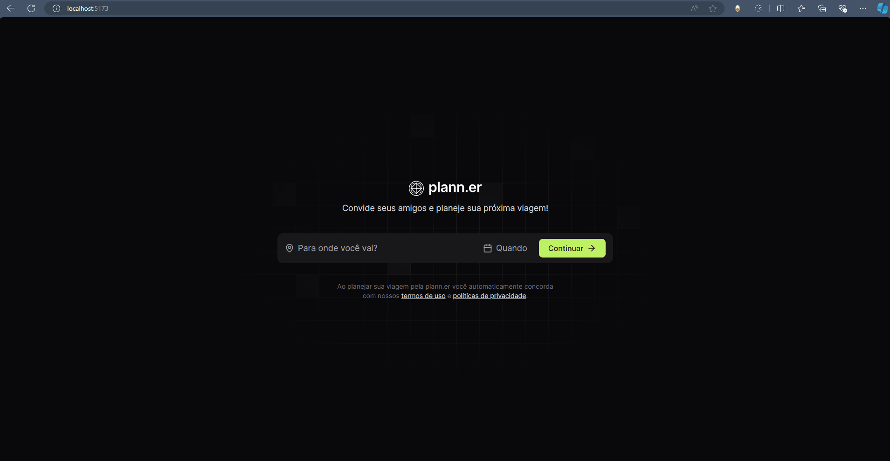

# Next Level Week Journey - React Trial

Plann.er is an application where you can create and manage events and invite someone to do some activity together.



## Contents

- [Overview](#overview)
- [Learnings](#learnings)
    - [React Router](#react-router)
    - [Component Props](#component-props)
    - [Tailwind Variants](#tailwind-variants)
    - [React Day Picker](#react-day-picker)
- [Next Steps](#next-steps)
- [Reference](#refereces)

## Overview

The main purpose of the application is to handle events and inviting people to do something together. 

Built on top of React and others tools like Vite and Tailwind, Plann.er still are not 100% completed. There are some goals to achieve which I'll deal with soon like creating some components and manage event update information.

## Learnings

### React Router

One of the new interesting stuff are the React Router library and how it handles navigation between pages/components. Its a library that I definitely will be studying next weeks.

```ts
   try {
        const response: AxiosResponse<TripResponse> = await api.post<TripResponse>('/trips', options)
        const tripId = response.data.tripId
            navigate(`/trips/${tripId}`)
    } catch (error) {
        console.error('Erro ao fazer a requisição:', error);
    }
```
> Use of navigate function from useNavigate hook

### Component Props

ComponentProps is a React Generic Type that can be used to extends React components. This project uses ComponentProps on the Button component to extend its properties with all the properties that one button HTML tag can receive.

```tsx
interface ButtonProps extends ComponentProps<'button'>, VariantProps<typeof buttonVariants> {
    children: ReactNode
}
```

### Generic Types

The generic type isn't a concept that has been implemented in this project, but it is a concept that I discovered recently and possibly able to be introduce in some parts of it. Actually, the ComponentProps discursed early, is an example of its use by React.

### Tailwind Variants

Tailwind Variants is a library that provides a way to create a variation of a component. It was used in the button component as we see below.

```ts
import { tv, VariantProps } from 'tailwind-variants'

const buttonVariants = tv({
    base: 'rounded-lg px-5 py-2 font-medium flex items-center gap-2 justify-center',
    variants: {
        variant: {
            primary: 'bg-lime-300 text-lime-950 hover:bg-lime-400',
            secondary: 'bg-zinc-800 text-zinc-200  hover:bg-zinc-700'
        },
        size: {
            default: 'py-2',
            full: 'w-full h-11',
        }
    },
    defaultVariants: {
        variant: 'primary'
    }
})
```

### React Day Picker

React Day Picker it's a library that provides us a date picker component customisable. That's it.

## Next Steps

### Increase Componentization

There is some parts of the user interface which can be turned into reusable components, for example, the modals and links at the important links section. So, this is one of the goals in mind.

### Trip Update

Introduce a new feature providing a way to update the trip information also is one goal in mind.

### Fallback Content

Sometimes we deal with some requests that require some time to be completed and, looking the user's perspective, they should be able to comprehend this through a fallback while content is loading. To do this, React has the Suspense functionality.

## Refereces

- [Vite](https://vitejs.dev/)
- [React](https://react.dev/)
- [React Router](https://reactrouter.com/en/main)
- [Tailwind](https://tailwindcss.com/)
- [Tailwind Variants](https://www.tailwind-variants.org/)
- [React Day Picker](https://daypicker.dev/)
- [Get In Touch](https://joaobraz.dev)